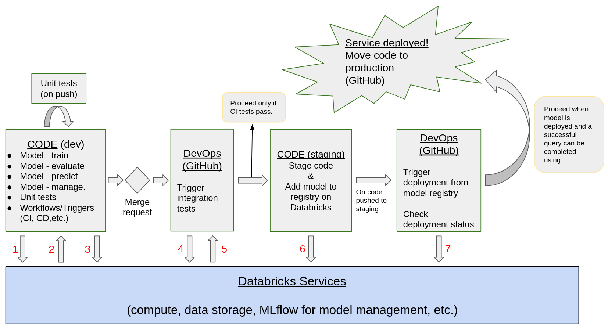

# Financial Fraud Detection Service on Databricks

Associated with EC 528 at Boston University  
Group 11

The respository created for our class work can be found at this link: [mlops-with-databricks](https://github.com/EC-CS-528-BU-Cloud-Computing/mlops-with-databricks)  
This is a secondary repo where we can develop and build operations structure without cluttering our main project repository.

## Purpose

This repo is a place for our group to build a financial fraud detection service via Databricks and AWS.

## Goal

Our goal with this repository is to build a machine learning service on Databricks that can detect financial fraud from bank transactions. The focus of our project was the operations that allow developers to build a financial fraud detection system. We focused on the code base to support fraud detection not the machine learning model development.

We used a basic machine learning model to detect financial fraud and did not worry about the quality of the service. Our goal was not to develop a novel and high-performing fraud detection model. Instead, we used this model as an example so that we could develop supporting operations that could be easily adapted to other models. Additionally, we weren't concerned with working with real data. Thus, we used a single table with synthetic financial transaction data. If we ever needed a mock data source, we extracted a portion of this table to generate a "new" data source.

The kinds of things we spent the most time developing...
* **Tests** that ensure code and model quality during the model development process
* **Modular workflows** that allow model- and data-specific code to be easily modified without requiring significant changes the service code base
* **Environment configuration** that allowed computation resources to be created to run automated tasks supporting model & code development
* **Model deployment** that made the service available to those outside of the developer workspace on Databricks

## Description of the Service

**NOTE**: We worked on this service in two separate workspaces - (1) Databricks-AWS and (2) Databricks-Azure workspaces. **_This image and description are specific to the Databricks-AWS work_**.

### Conceptual Explanation

The operations that we were working on are supposed to support the analysts and scientists who are trying to develop and deploy an ML model that can identify potential fraud from bank transactions. Ideally, the operations are modular and easily adaptable to other ML tasks as well.

The theoretical workflow is as follows:
* Data scientists, analysts, software engineers, etc. create new code in feature branches and merge those updates to the `dev` branch.
* Unit tests evaluate the new code when added to the `dev` branch.
  - With a larger service and more developers, all or some of these unit tests should be done when new merge requests are created to merge features branches into `dev`
* A merge request for `dev` to `staging` is created when the developers believe new version of the code base is ready.
* The merge request triggers additional evaluation of the code:
  - Continuous integration tests that attempt to use train a new financial fraud detection model using the code
  - Additional unit testing and code checks that ensure developer code meets initial expectations expectations
  - *IMPORTANT* (not necessarily common practice): The model trained during continuous integration is the version of the model deployed assuming tests pass. We did not plan to train a new model from the `staging` code after merge request approval.

**NOTE**: *From here on, the design is particularly tailored to our small project than a large-scale business service. We intended to automate most steps with automated tests which should have human review for a real ML service provided to customers.*

* Developer code that passes the tests and code review moves to `staging`
  - It is assumed that any code associated with creation and use of the model has been tested at this point (e.g., training and testing)
  - After this point, most of this code has been used and will not be needed again because *we register a model in the Databricks model registry at this point.*
* New code pushed to the `staging` branch means we have a new model that we can attempt to deploy.
* Continuous deployment is attempted:
  - Model serving is activated for the new model in the model registry
  - An attempt to query the new model is made to ensure it is available for use.
* Upon successful deployment, model and code are available for production usage by customers.

- [ ] Add something about production CI/CD so that new models can be trained with new data.

#### Changes that should be made in retrospect
* `staging` code should be assumed to be tested and functional, meaning deployment scripts, workflows, jobs, etc. should be tested by this point. In paricular, this means deployment should have been attempted before reaching this step.
* On the other hand, the model created during the testing process before code is moved to staged does not need to be used in production. The whole point of having these stages for the code is that the code in production can be used to regularly re-train models and update the model in production if needed.

### Diagram

### Step-by-step Explanation of the Implmentation

*To be continued...*

